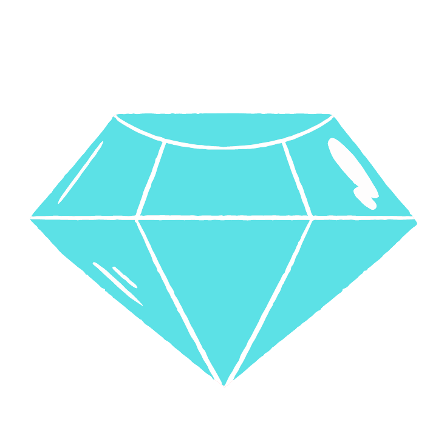
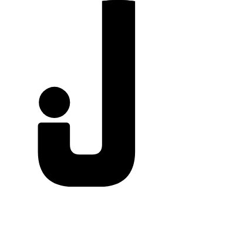
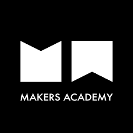
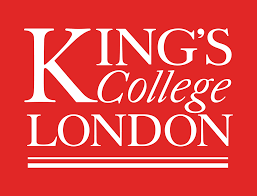

## Jessica Gordon

[PROJECTS](#projects) | [SKILLS](#skills) | [EDUCATION](#education) | [EXPERIENCE](#experience) | [HOBBIES](#hobbies) | [LINKEDIN](https://uk.linkedin.com/in/jessica-gordon-5b8875200)

I’m a Full Stack Junior Developer, having recently completed a highly selective, intensive 16-week coding Bootcamp at [Makers Academy](http://www.makersacademy.com/).

I have unashamedly fallen for code in the past year - I’ve found a tool with endless possibilities where I can utilise some of my strongest skills; problem-solving, creative and critical thinking, empathy, and teamwork. The constant evolution of technology, its opportunities to collaborate with others from different backgrounds, and its potential to help solve the smallest to some of the largest problems we currently face is just wildly cool!

## Projects

| Name | Description | Code/Demo Links | Tech/tools |
| ---- |------------ | --------------- | ---------- |
| 
**Crosswordle**  
 | A Wordle inspired web app in which the user has to guess the correct five-letter words in a 5x5 grid, ensuring they only use available letters and match up the words according to the game mode. New challenges are presented each day. | 
[Crosswordle website](https://crosswordle-production.herokuapp.com/normal)      
 | React, CSS & Bulma, Python, Jest, Enzyme, React Testing Library |
| 
**GemJunkies**   
 | A Facebook clone in which a user can sign up, add friends, view profiles, post messages and images, and add comments, likes and gems | 
[GemJunkies website](http://gem-junkies.herokuapp.com)   
 | Ruby on Rails, PostgreSQL for Active Record, HTML, CSS & Bulma, RSpec, capybara |
| 
**JESSKETCHES website**   
| A website to host and sell artwork built for my final project for CS50| 

 | Flask framework, Python, SQLite, Javascript, HTML, CSS & Bootstrap 5, Jinja     |

## Skills

#### Creative Problem Solver

I like to think creatively and see the potential for a simpler, more accurate or quicker way to do things. I successfully initiated and completed two service improvements whilst working for the local government - these projects resulted in saved time, decreased the risk of human error, and improved functionality. 

Resolving blockers excite and energise me - when something has not worked as it should within team projects, I’ve jumped at the opportunity to analyze the symptoms, identify what’s wrong and find a solution. It’s in these moments I’ve valued Maker’s EQ curriculum, having learnt the art of knowing when to step away, make a cup of tea and regain perspective!

#### Quick Learner

Historically, management has noticed I tend to pick up new tasks quickly. As such, I have been asked to temporarily take on work from other service areas when required. For our final project at Makers, I thrived off of the challenge of learning a new framework along with using new data structures (tries) all within a tight timeframe.

#### Motivated

I strive for excellence, both academically (gained a First Class Honours Degree in Midwifery studies) and in work (promotion to senior within one year of working in local government). Within one week of finishing the Makers Bootcamp, I have signed up for my first hackathon alongside other tech events, and have plans to begin developing my InvestTheRest app alongside completing an algorithmic complexity course. 

#### Communication

I am malleable in my communication style due to my empathetic nature; from respectfully discussing highly sensitive and confidential information with various public sector professionals and residents, to keeping training for new starters fun, inclusive and light-hearted. I passionately believe that sharing knowledge is sharing power. I’ve made myself available to train colleagues in my previous areas of work, and more recently became a mentor for a developer who has just begun their journey at Makers.

#### Teamwork

In my previous role, teamwork skills were essential to ensure SLAs were met and motivations remained high in an emotionally heavy environment. Over two hundred hours of pair programming and three team projects later, I’ve learnt the importance of quiet consideration too - such as maintaining clean code for the ease of other developers.

#### Critical Thinker

My favourite part of my degree was my dissertation - I love to pick apart ideas and evidence, considering their value. Developers I’ve partnered with have noticed that I tend to quickly spot when we are coding our way onto an erroneous path.

## Education

\
**Makers Academy** (Oct 2021 to Feb 2022)\
Full-Time Intensive Coding Bootcamp

- Focus on self-directed learning and the power of pair programming.
- Topics included test-driven development, agile working practices, object-oriented design, debugging, MVC web app design, single-page web app design, databases, code reviews, building in a team to a specification and from scratch, learning a new language, EQ curriculum.
- Languages included Ruby, Javascript plus CSS and HTML.
- Gained a new obsession for well tested, clean code.\

\
**Harvard University** (Mar 2021 to Aug 2021)\
CS50's Introduction to Computer Science

- An entry-level course taught by David J. Malan, CS50x teaches students how to think algorithmically and solve problems efficiently.
- Topics included abstraction, algorithms, data structures, encapsulation, resource management, security, software engineering, and web development.
- Languages included C, Python, SQL, and JavaScript plus CSS and HTML.
- Problem sets inspired by real-world domains of biology, cryptography, finance, forensics, and gaming.\

\
**King's College London** (Sep 2012 to April 2016)\
Bachelor of Science: Midwifery Studies and Registration as a Midwife

- First Class Honours

**Vyners Secondary School** (Sep 2009 to Sep 2011)\
A Levels

- 3 A\*s in Mathematics, Chemistry and Psychology
- A (AS Level) in Art

## Experience

**London Borough of Hillingdon** (Mar 2017 to Aug 2020)  
Technical Support Officer, with promotion to a Senior Technical Support Officer within one year

- Provided high quality technical administrative support for Children’s Safeguarding and Quality Assurance Services.
- Utilised my problem-solving skills to successfully initiate and complete service improvements to boost efficiency and accuracy.
- Matured communication styles whilst training and supporting new team members including managers.
- Remained focused whilst monitoring workloads and resources when required to step in for the manager.
- Gained a wider understanding of the business by being available as the first point of contact for internal queries related to our team’s services, and by being involved in the recruitment process from shortlisting to interviewing, to induction.

**Baby Talk Angell Town** (May 2016 to Dec 2016)  
Community Project Administrator

- Supported the development of a resident-focused parish midwife project in an inner-city ward of London, which received a mention in Southbank’s Women of the World festival and were runners up in the Ecclesiastical Insurance 2016 competition.
- Remained motivated in a highly autonomous role whilst preparing; research-based rationale, promotional resources, draft funding applications, draft policies and newsletters.
- Demonstrated communication skills while developing and maintaining relationships with residents and stakeholders.
- Maintained organisation of the project by developing a filing system, and planning events and meetings.

## Hobbies

Chuck me a pen, paintbrush, polymer clay, anything crafty along with a pair of headphones and a Spotify subscription and I'll be sorted. I do also go outside and love visiting new places. I've spent six months completing voluntary work in Cusco, Peru. Coming back home to a new episode of ‘never too small’ is perfection (architects reimaging small space living).